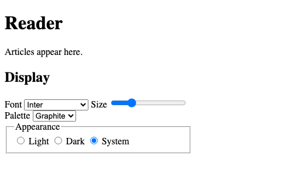

# Display

## Display panel

The Display panel sets how the Reader app looks for one person, and remembers the choice.

```text
+---------------------------+
| Display                   |
| Font     [ Inter       v] |
| Size     [----o--------]  |
| Palette  [ Graphite    v] |
| (o) Light ( ) Dark (x) Sys|
+---------------------------+
```

## First paint



The page paints in the stored theme from the start.
