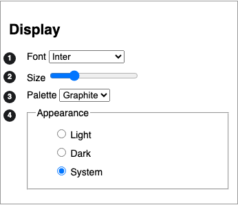

# Display

## Display panel

The Display panel sets how the Reader app looks for one person, and remembers the choice.

The panel in the Graphite skin, light mode, at 100 percent scale:

1. Font chooses the reading face.
2. Size scales the text from 90 to 130 percent.
3. Palette picks Graphite, Slate or Sage.
4. Appearance follows the system, or forces light or dark.

## First paint

The stored choice is on the page before anything paints, so the reader never sees the wrong theme first.
