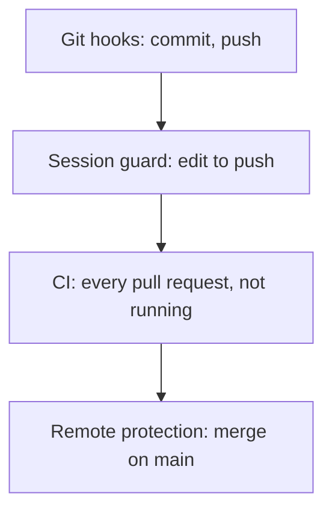

Four planes can enforce the git rules here; CI is present but never runs.

```mermaid
graph TD
  hooks[Git hooks: commit, push] --> guard[Session guard: edit to push]
  guard --> ci[CI: every pull request, not running]
  ci --> remote[Remote protection: merge on main]
```
Each plane sits at the moments it acts.
