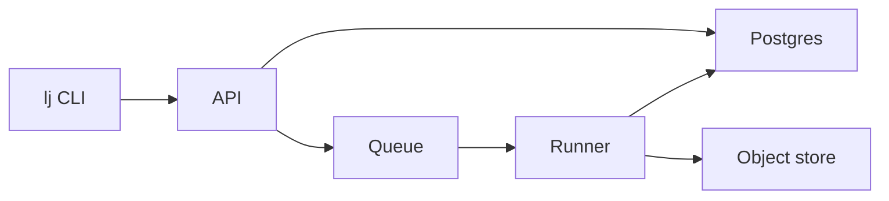

# Ledger jobs

Ledger jobs runs scheduled accounting jobs against the ledger database.

## Usage

`lj run <job>` runs one job now.

## Architecture

```mermaid
graph LR
  CLI[lj CLI] --> API
  API --> Queue
  Queue --> Runner
  Runner --> Postgres
  API --> Postgres
  Runner --> Store[Object store]
```
